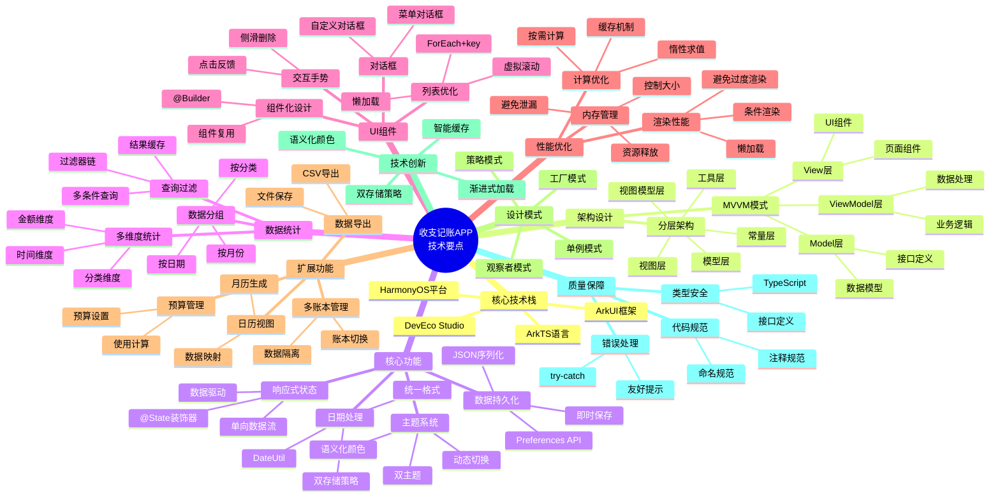
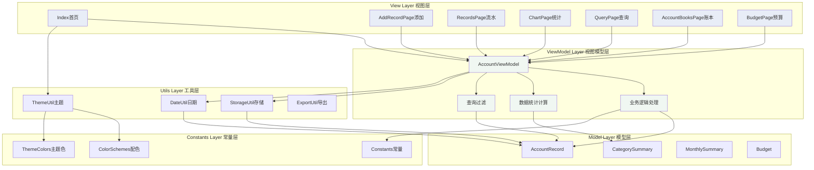
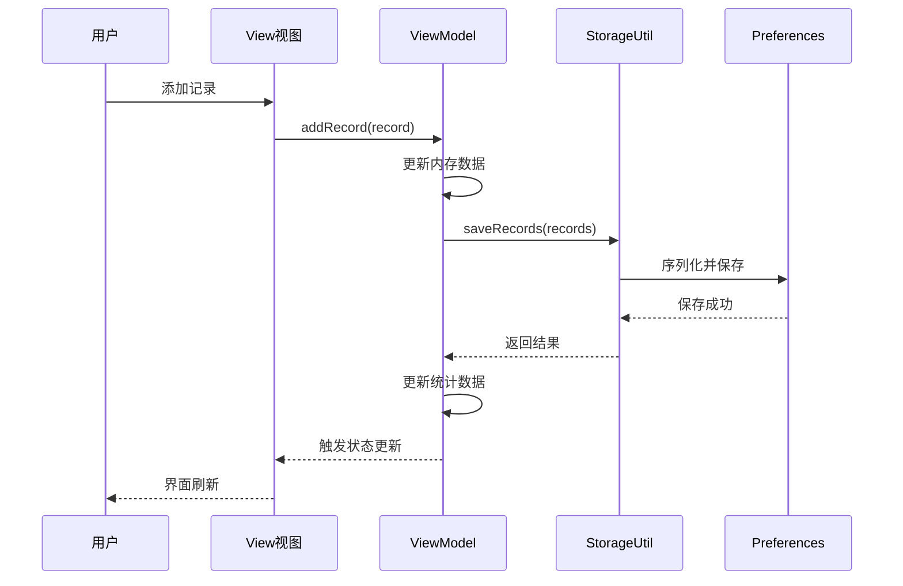
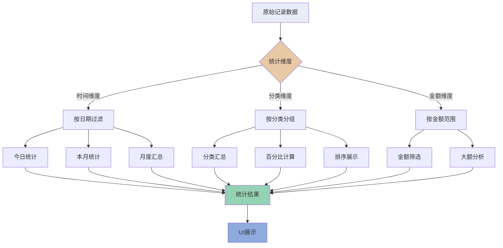
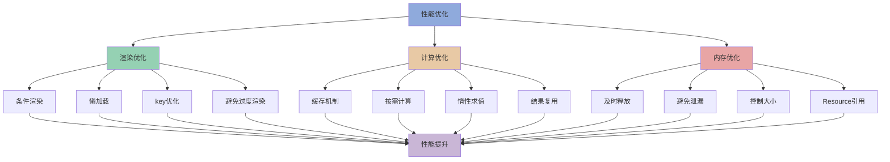
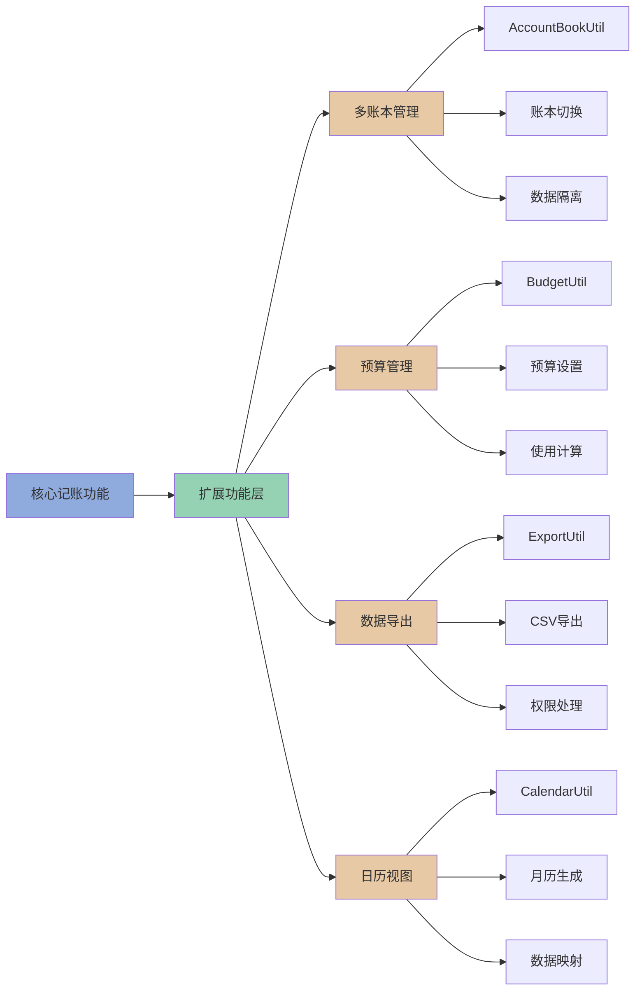

# 收支记账APP - 技术要点思维导图

## 思维导图（文本格式）

```
收支记账APP技术要点
│
├─ 1. 核心技术栈
│  ├─ 开发语言: ArkTS (TypeScript超集)
│  ├─ UI框架: ArkUI (声明式UI)
│  ├─ 目标平台: HarmonyOS 3.0+
│  └─ 开发工具: DevEco Studio 4.0+
│
├─ 2. 架构设计
│  ├─ MVVM模式
│  │  ├─ Model层: 数据模型定义
│  │  │  ├─ AccountRecord (账户记录)
│  │  │  ├─ CategorySummary (分类统计)
│  │  │  └─ MonthlySummary (月度汇总)
│  │  ├─ ViewModel层: 业务逻辑
│  │  │  ├─ AccountViewModel
│  │  │  ├─ 数据统计与汇总
│  │  │  ├─ 查询过滤
│  │  │  └─ 分类计算
│  │  └─ View层: 视图组件
│  │     ├─ Index (首页)
│  │     ├─ AddRecordPage (添加记录)
│  │     ├─ RecordsPage (流水)
│  │     ├─ ChartPage (统计)
│  │     ├─ QueryPage (查询)
│  │     ├─ AccountBooksPage (账本管理)
│  │     └─ BudgetPage (预算管理)
│  │
│  └─ 分层架构
│     ├─ View Layer (视图层)
│     ├─ ViewModel Layer (视图模型层)
│     ├─ Model Layer (模型层)
│     ├─ Utils Layer (工具层)
│     └─ Constants Layer (常量层)
│
├─ 3. 核心功能实现
│  ├─ 响应式状态管理
│  │  ├─ @State装饰器
│  │  ├─ 数据驱动UI更新
│  │  ├─ 单向数据流
│  │  └─ 派生状态计算
│  │
│  ├─ 数据持久化
│  │  ├─ Preferences API
│  │  ├─ JSON序列化
│  │  ├─ 即时保存策略
│  │  └─ 读写分离设计
│  │
│  ├─ 日期处理
│  │  ├─ DateUtil工具类
│  │  ├─ 统一日期格式 (YYYY-MM-DD)
│  │  ├─ 双存储策略 (timestamp + string)
│  │  └─ 时区问题处理
│  │
│  └─ 主题系统
│     ├─ 双主题支持 (浅色/深色)
│     ├─ 语义化颜色变量
│     ├─ 动态主题切换
│     └─ 主题状态持久化
│
├─ 4. 数据统计与分析
│  ├─ 多维度统计
│  │  ├─ 时间维度
│  │  │  ├─ 今日统计
│  │  │  ├─ 本月统计
│  │  │  ├─ 按月汇总
│  │  │  └─ 按年汇总
│  │  ├─ 分类维度
│  │  │  ├─ 分类汇总
│  │  │  ├─ 百分比计算
│  │  │  └─ 排序展示
│  │  └─ 金额维度
│  │     ├─ 金额范围筛选
│  │     └─ 大额/小额分析
│  │
│  ├─ 查询过滤
│  │  ├─ 多条件组合查询
│  │  ├─ 过滤器链模式
│  │  ├─ 短路求值优化
│  │  └─ 结果缓存
│  │
│  └─ 数据分组
│     ├─ 按日期分组
│     ├─ 按月份分组
│     └─ 按分类分组
│
├─ 5. UI组件技术
│  ├─ 组件化设计
│  │  ├─ @Builder装饰器
│  │  ├─ 组件复用
│  │  └─ 统一样式
│  │
│  ├─ 列表渲染优化
│  │  ├─ ForEach + key函数
│  │  ├─ 懒加载
│  │  ├─ 虚拟滚动思想
│  │  └─ 分页加载
│  │
│  ├─ 交互手势
│  │  ├─ 侧滑删除
│  │  ├─ 下拉刷新
│  │  └─ 点击反馈
│  │
│  └─ 对话框
│     ├─ CustomDialogController
│     ├─ 自定义对话框
│     └─ 菜单对话框
│
├─ 6. 路由导航
│  ├─ 页面跳转
│  │  ├─ router.pushUrl()
│  │  ├─ 参数传递
│  │  └─ router.back()
│  │
│  └─ 生命周期
│     ├─ aboutToAppear()
│     ├─ onPageShow()
│     └─ onPageHide()
│
├─ 7. 性能优化
│  ├─ 渲染性能
│  │  ├─ 条件渲染
│  │  ├─ 懒加载策略
│  │  ├─ 避免过度渲染
│  │  └─ 使用key优化
│  │
│  ├─ 数据计算优化
│  │  ├─ 缓存机制
│  │  ├─ 按需计算
│  │  ├─ 惰性求值
│  │  └─ 缓存失效策略
│  │
│  └─ 内存管理
│     ├─ 及时释放资源
│     ├─ 避免内存泄漏
│     ├─ 控制数据大小
│     └─ Resource引用
│
├─ 8. 扩展功能
│  ├─ 多账本管理
│  │  ├─ AccountBookUtil
│  │  ├─ 账本切换
│  │  ├─ 数据隔离
│  │  └─ 命名空间策略
│  │
│  ├─ 预算管理
│  │  ├─ BudgetUtil
│  │  ├─ 预算设置
│  │  ├─ 使用情况计算
│  │  └─ 预算提醒
│  │
│  ├─ 数据导出
│  │  ├─ ExportUtil
│  │  ├─ CSV格式导出
│  │  ├─ 文件保存
│  │  └─ 权限处理
│  │
│  └─ 日历视图
│     ├─ CalendarUtil
│     ├─ 月历生成
│     ├─ 数据映射
│     └─ 可视化展示
│
├─ 9. 设计模式
│  ├─ 单例模式
│  │  └─ 工具类实现
│  ├─ 观察者模式
│  │  └─ 响应式系统
│  ├─ 策略模式
│  │  └─ 查询过滤
│  └─ 工厂模式
│     └─ ID生成
│
├─ 10. 技术难点与解决方案
│  ├─ 数据一致性
│  │  ├─ 单一数据源
│  │  ├─ 统一更新入口
│  │  └─ 全局状态管理
│  │
│  ├─ 日期时区处理
│  │  ├─ 字符串比较
│  │  ├─ 避免时区转换
│  │  └─ 本地化显示
│  │
│  ├─ 大数据量性能
│  │  ├─ 分页加载
│  │  ├─ 虚拟滚动
│  │  └─ 数据缓存
│  │
│  └─ 主题切换闪烁
│     ├─ 预加载资源
│     ├─ 过渡动画
│     └─ 批量更新
│
├─ 11. 技术创新点
│  ├─ 语义化颜色系统
│  │  ├─ 主题切换简单
│  │  ├─ 代码可读性强
│  │  └─ 维护成本低
│  │
│  ├─ 双存储策略
│  │  ├─ timestamp + string
│  │  ├─ 避免频繁转换
│  │  └─ 性能与便利平衡
│  │
│  ├─ 渐进式功能加载
│  │  ├─ 核心功能优先
│  │  ├─ 扩展功能按需
│  │  └─ 减少初始加载
│  │
│  └─ 智能缓存策略
│     ├─ 基于使用频率
│     ├─ 自动失效机制
│     └─ 内存占用可控
│
├─ 12. 代码质量保障
│  ├─ 类型安全
│  │  ├─ TypeScript类型系统
│  │  ├─ 接口定义
│  │  └─ 类型推断
│  │
│  ├─ 代码规范
│  │  ├─ 命名规范
│  │  ├─ 注释规范
│  │  └─ 代码格式
│  │
│  └─ 错误处理
│     ├─ try-catch包裹
│     ├─ 友好提示
│     └─ 日志记录
│
├─ 13. 性能指标
│  ├─ 启动性能
│  │  ├─ 冷启动 < 1s
│  │  ├─ 热启动 < 0.3s
│  │  └─ 首屏渲染 < 0.5s
│  │
│  ├─ 运行性能
│  │  ├─ 列表滚动 60 FPS
│  │  ├─ 页面切换 < 0.2s
│  │  └─ 数据保存 < 0.1s
│  │
│  └─ 资源占用
│     ├─ 基础内存 ~30MB
│     ├─ 应用大小 ~2MB
│     └─ 内存峰值 < 100MB
│
└─ 14. 最佳实践
   ├─ 开发最佳实践
   │  ├─ 状态管理
   │  ├─ 组件设计
   │  ├─ 性能优化
   │  └─ 错误处理
   │
   ├─ 代码组织
   │  ├─ 模块化结构
   │  ├─ 清晰的分层
   │  └─ 职责分离
   │
   └─ 测试实践
      ├─ 单元测试
      ├─ 集成测试
      └─ 性能测试
```


## Mermaid思维导图（可视化）



## 核心技术架构图



## 数据流转图



## 状态管理流程图

```mermaid
graph LR
    A[用户操作] --> B[@State状态变化]
    B --> C[自动触发UI更新]
    C --> D[重新渲染组件]
    D --> E[显示最新数据]
    
    B --> F[派生状态计算]
    F --> G[todayIncome]
    F --> H[todayExpense]
    F --> I[monthIncome]
    F --> J[monthExpense]
    
    G --> C
    H --> C
    I --> C
    J --> C
    
    style B fill:#95D1B3
    style C fill:#8FAADC
    style F fill:#E8C9A5
```

## 主题系统架构图

```mermaid
graph TB
    A[ThemeUtil主题工具] --> B{当前主题}
    B -->|light| C[浅色主题]
    B -->|dark| D[深色主题]
    
    C --> E[LIGHT_THEME颜色]
    D --> F[DARK_THEME颜色]
    
    E --> G[语义化颜色变量]
    F --> G
    
    G --> H[primary主色]
    G --> I[income收入色]
    G --> J[expense支出色]
    G --> K[background背景色]
    G --> L[textPrimary文字色]
    
    H --> M[应用到UI组件]
    I --> M
    J --> M
    K --> M
    L --> M
    
    M --> N[自动更新界面]
    
    style A fill:#8FAADC
    style C fill:#FAF9F7
    style D fill:#1A1A1A
    style G fill:#E8C9A5
```



## 数据统计流程图



## 性能优化策略图



## 扩展功能架构图



---

**说明**:
1. 文本格式思维导图适合打印和文档阅读
2. Mermaid图表可以在支持Mermaid的Markdown查看器中渲染
3. 建议使用支持Mermaid的工具查看可视化图表（如Typora、VS Code + Mermaid插件、GitHub等）

**文档版本**: 1.0  
**最后更新**: 2024年  
**维护者**: 收支记账APP开发团队
